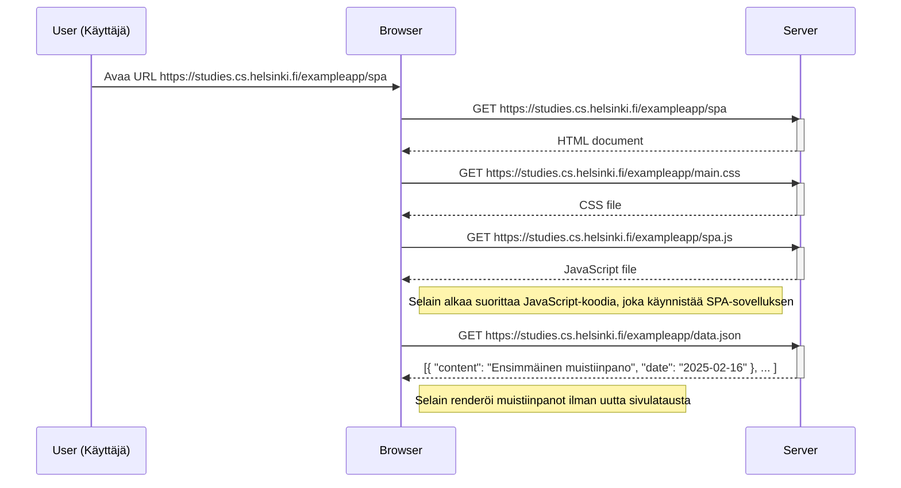

```mermaid
sequenceDiagram
    participant user as User (Käyttäjä)
    participant browser as Browser
    participant server as Server

    user->>browser: Avaa URL https://studies.cs.helsinki.fi/exampleapp/spa
    
    browser->>server: GET https://studies.cs.helsinki.fi/exampleapp/spa
    activate server
    server-->>browser: HTML document
    deactivate server
    
    browser->>server: GET https://studies.cs.helsinki.fi/exampleapp/main.css
    activate server
    server-->>browser: CSS file
    deactivate server
    
    browser->>server: GET https://studies.cs.helsinki.fi/exampleapp/spa.js
    activate server
    server-->>browser: JavaScript file
    deactivate server
    
    Note right of browser: Selain alkaa suorittaa JavaScript-koodia, joka käynnistää SPA-sovelluksen
    
    browser->>server: GET https://studies.cs.helsinki.fi/exampleapp/data.json
    activate server
    server-->>browser: [{ "content": "Ensimmäinen muistiinpano", "date": "2025-02-16" }, ... ]
    deactivate server
    
    Note right of browser: Selain renderöi muistiinpanot ilman uutta sivulatausta
```
